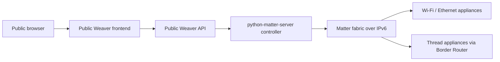

# Weaver Internet Deployment

Weaver can be exposed as a public website, but Matter control still needs a controller process with access to the Matter fabric.

## Realistic Architecture



Matter appliance commands are not sent directly from the browser. The browser calls Weaver's API over HTTPS. Weaver then asks `python-matter-server` to control commissioned Matter nodes using Matter operational traffic over IPv6.

## Deployment Modes

### 1. Public UI and Public API on the Matter Network

Run the frontend and backend on a host that can also reach `python-matter-server` and the virtual Matter appliances. Expose the frontend/API through HTTPS using a reverse proxy or tunnel.

This is the simplest realistic Podman test if the virtual appliances, Matter server, and Weaver backend all live on the same machine or IPv6-capable network.

### 2. Public UI with Home/Lab Controller

Host the frontend publicly, but keep Weaver API or a small controller service inside the home/lab network with `python-matter-server`.

The public frontend must call the reachable API URL:

```text
NEXT_PUBLIC_API_URL=https://api.your-weaver-domain.example
```

### 3. Cloud Backend with Local Agent

If the backend is hosted in the cloud, it usually cannot discover or control local Matter devices directly because Matter uses local IPv6 operational discovery and fabric credentials. In that case, run a local agent/controller near the Matter fabric and connect it to the cloud backend over a secure outbound channel.

## Required Environment

Frontend:

```text
NEXT_PUBLIC_API_URL=https://api.your-weaver-domain.example
```

Backend:

```text
FRONTEND_ORIGINS=https://your-weaver-domain.example
MATTER_SERVER_WS_URL=ws://127.0.0.1:5580/ws
API_HOST=0.0.0.0
API_PORT=8000
```

Use `FRONTEND_ORIGINS=*` only for local testing.

## Realism Checklist

- Commission appliances with Matter QR/manual setup payloads.
- Do not register fake localhost appliances from the UI.
- Ensure virtual appliances and `python-matter-server` share an IPv6-capable network path.
- Ensure mDNS/DNS-SD works for Matter discovery, or use the Matter server's supported discovery path.
- For Thread realism, use an OTBR/Thread Border Router topology rather than plain localhost containers.
- Expose web traffic through HTTPS before inviting remote users.
